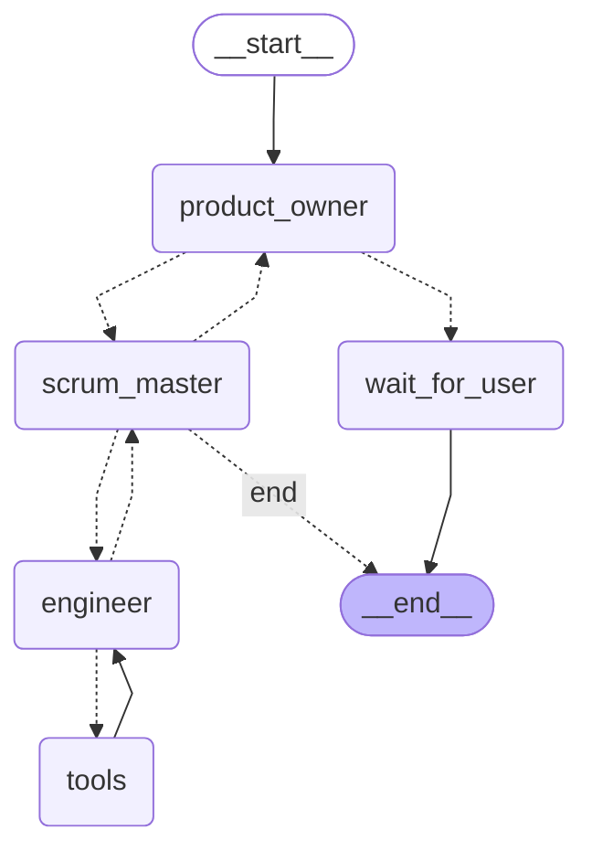

# 🛝 Python Chainlit Multi-agents Playground


As the name of the repository suggests, it's just a [_playground_](https://dictionary.cambridge.org/dictionary/english/playground).
A place to better understand using [chainlit](https://github.com/Chainlit/chainlit), while employing various agents utilising large language models (LLM) via
various inference providers to accomplish a given task. This project aims to be agent development kit (adk) agnostic as possible.

## LangGraph diagram

Here's a step-by-step interpretation of the flow of the LLM.

<p style="text-align:center"> 🚧  👷 Currently in the early stages of development, current graph implementation might change. 👷 🚧 </p>



<!---
graph.get_graph().draw_mermaid()
--->

## Prerequisites

1. [Docker for desktop](https://docs.docker.com/desktop/)
2. [Ollama](https://ollama.com/download)
3. [uv](https://docs.astral.sh/uv/#installation)

### Usage via `pip`

1. Install python packages used for the project

```pycon
pip install -r requirements.txt
```

2. Run the application

```pycon
chainlit run app.py
```

### Usage via `uv`

1. Install python packages used for the project

```pycon
uv sync
```

2. Run the application

```pycon
uv run chainlit run app.py
```

### Usage via `docker compose`

1. Run the following command within the root directory, this will build the chainlit [docker image](Dockerfile) and pull various
   docker images from [docker hub](https://hub.docker.com/)

```shell
docker compose up --build -d
```

2. As this container also runs Ollama, please wait for the `ollama-setup-1` to finish pulling your specified large language
   model.

```shell
 2024-01-31 23:36:50 {"status":"verifying sha256 digest"}
 2024-01-31 23:36:50 {"status":"writing manifest"}
 2024-01-31 23:36:50 {"status":"removing any unused layers"}
 2024-01-31 23:36:50 {"status":"success"}
 100 1128k    0 1128k    0    21   2546      0 --:--:--  0:07:33 --:--:--    23
```
